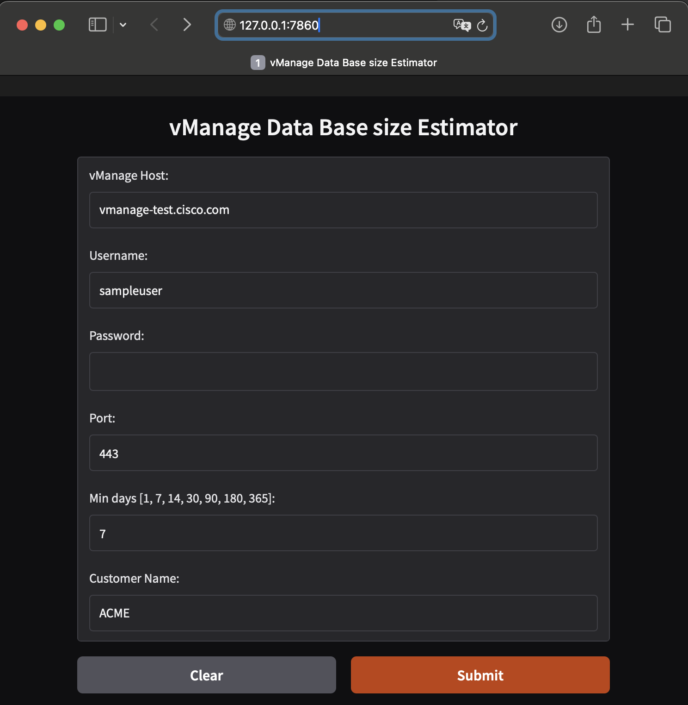

# vManage DB Estimator

vManage DB Estimator is a Python-based tool designed to estimate database requirements for Cisco SD-WAN vManage deployments. This tool provides a user-friendly GUI to simplify the estimation process.

It uses the cisco-catalyst-wan-sdk to connect to a live Manager instance, retrieves database statistics, and provides recommendations for storage allocation based on the number of days of data retention specified by the user.

## Features

- Estimates storage requirements for different data retention periods.
- Generates a CSV report with detailed database statistics.
- Provides recommendations for storage allocation.
- Identifies unused indexes and their allocated space.
- User-friendly GUI for input and visualization.

## File Structure

The repository is organized as follows:

```plaintext
VMANAGE_DB_ESTIMATOR/
├── estimator.py          # Main script to run the application
├── requirements.txt      # Dependencies required for the project
├── README.md             # Project documentation
├── LICENSE.txt           # License information
├── examples/             # Images and other assets for the project
│   ├── inputs.png
│   └── results.png
│   └── sample_credetials.sh
│   └── sample_csv_report.csv
└── data/                 # Output files
```

## Installation

1. Clone the repository:

    ```plaintext
    git clone https://github.com/rulerdo/VMANAGE_DB_ESTIMATOR.git
    cd VMANAGE_DB_ESTIMATOR
    ```

2. Install the required dependencies:

    ```plaintext
    pip install -r requirements.txt
    ```

3. Optionally you can setup environment variables to automatically populate the GUI inputs. See example [credentials file](/examples/sample_credentials.sh)

    ```plaintext
    source sample_credentials.sh
    ```

## Usage

1. Run the script using the following command:

    ```plaintext
    python estimator.py
    ```

2. To see the GUI, click the link provided on the terminal to open it on your browser

    ```plaintext
    * Running on local URL:  http://127.0.0.1:7860
    ```

3. Input the following parameters in the GUI.

    ```plaintext
    vManage Host: The IP or hostname of the vManage instance.
    Username: The username for authentication.
    Password: The password for authentication.
    Port: The port number for the vManage instance.
    Min days: The minimum number of days for data retention (options: 1, 7, 14, 30, 90, 180, 365).
    Company Name: The name of the customer for the report.
    ```

4. Click on submit to connect to vManage and calculate the storage requirements.

5. Review the results displayed on the right side of the GUI, open the csv report to view all details.

## Examples

### Inputs



### Results


[Sample CSV report](examples/sample_csv_report.csv)

## License

This project is licensed under the terms specified in the [license file](./LICENSE.txt)

## Contributing

Contributions are welcome! Please fork the repository and submit a pull request with your changes.

## Support

If you encounter any issues, feel free to open an issue on the [GitHub repository](https://github.com/rulerdo/VMANAGE_DB_ESTIMATOR/issues).
